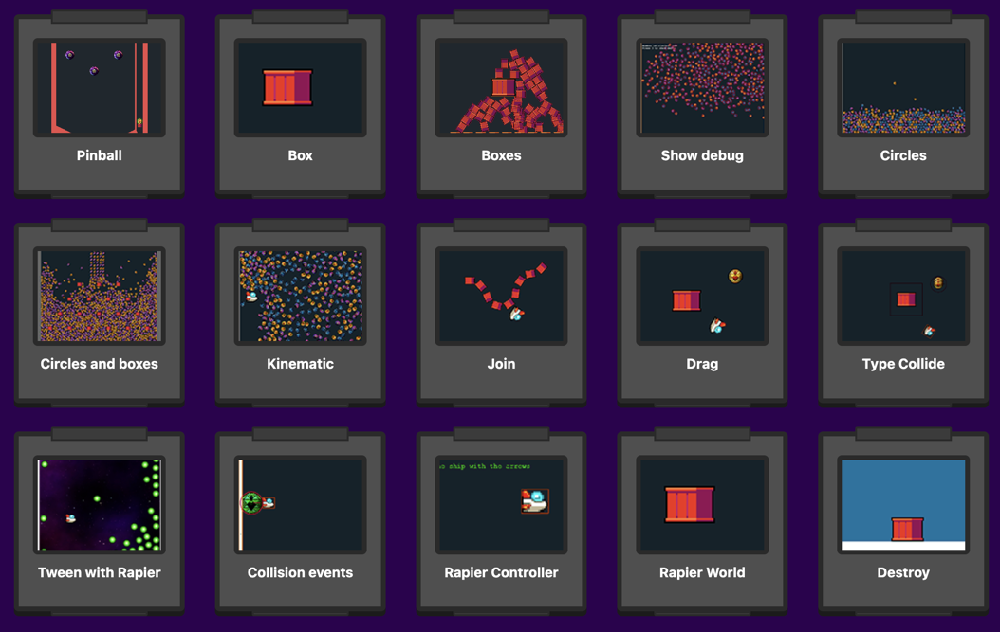

# Rapier Plugin for Phaser 3

This connector plugin allows you to easily integrate the [Rapier](https://rapier.rs) physics library with [Phaser 3](https://phaser.io), making it simple to create and manage rigid bodies within a physical world in Phaser.

For a template that directly integrates Rapier and Phaser without using a plugin please see the [template-rapier repository](https://github.com/phaserjs/template-rapier).

## Features

- Support for different types of rigid bodies: Dynamic, Fixed, Kinematic position-based or velocity-based.
- Phaser transformations: Optional integration to keep Phaser transformations (position and rotation) synchronized with physical bodies.
- Support for various collider shapes: Boxes, Spheres, Capsules, Triangles, etc.
- Debugging: Enable visual collider rendering for easier debugging.

## Source Code Examples

You can find 15 different code examples of how to use the Rapier Connector in this [Rapier Phaser Sandbox](https://phaser.io/sandbox/full/GcQ31KLH)

[](https://phaser.io/sandbox/full/GcQ31KLH)

## Installation

First, install the required dependencies via npm:

```bash
npm i rapier-connector
```

## Usage

### Creating the Physics World

To get started, you need to create a RAPIER physics world within your Phaser scene:

```js
import { RAPIER, createRapierPhysics } from 'rapier-connector';

class MyScene extends Phaser.Scene
{
    constructor()
    {
        super({ key: 'MyScene' });
    }

    preload()
    {
        // Load your assets here
    }

    async create()
    {
        // Initialize RAPIER
        await RAPIER.init();

        // Create the physics world with gravity
        const gravity = new RAPIER.Vector2({ x: 0, y: 400 });

        this.rapierPhysics = createRapierPhysics(gravity, this);

        // Enable debugging (optional)
        this.rapierPhysics.debugger(true);
    }

    update() {
        // Scene update logic
    }
}
```

### Creating Rigid Bodies

You can add rigid bodies to any Phaser Game Object as follows:

```js
import { RAPIER, createRapierPhysics } from 'rapier-connector';

class MyScene extends Phaser.Scene {

    async create()
    {
        // Initialize RAPIER
        await RAPIER.init();

        // Create the physics world with gravity
        const gravity = new RAPIER.Vector2({ x: 0, y: 400 });

        this.rapierPhysics = createRapierPhysics(gravity, this);

        const sprite1 = this.add.sprite(300, 300, 'ball');
        
        // Add rigid body with collider shapeType (shape collision are automatically created with the same size as the game object)
        const body1 = this.rapierPhysics.addRigidBody(sprite1, {
            rigidBodyType: RAPIER.RigidBodyType.Dynamic,  // Rigid body type [fixed | dynamic | kinematicVelocityBased | kinematicPositionBased]
            collider: RAPIER.ShapeType.Ball,  // Collider shape type or colliderDesc
        });

        const sprite2 = this.add.sprite(400, 300, 'box');

        // Add rigid body with colliderDesc
        const body2 = this.rapierPhysics.addRigidBody(sprite2, {
            rigidBodyType: RAPIER.RigidBodyType.Dynamic,
            collider: RAPIER.ColliderDesc.cuboid(halfWidth, halfHeight),  // Custom collider shape
        });

        const sprite3 = this.add.sprite(500, 300, 'ball');

        // Add rigid body with Phaser transformations enabled
        const body3 = this.rapierPhysics.addRigidBody(sprite3, {
            rigidBodyType: RAPIER.RigidBodyType.kinematicPositionBased,
            collider: RAPIER.ShapeType.Ball,
            phaserTransformations: true,
        });
    }
}
```

All rigid bodies are automatically synchronized with the Phaser Game Object's position and rotation.

However, the `phaserTransformations` boolean only works if the rigid body is of type `KinematicPositionBased`. You can enable or disable Phaser transformations by setting the `phaserTransformations` parameter to true or false.

The `addRigidBody` method returns an object with the rigid body and collider associated with the Game Object. You can use this object to access the rigid body and collider properties, just as if they were created using native RAPIER methods. For more details, please refer to the official documentation: [RAPIER JavaScript User Guide on Rigid Bodies](https://rapier.rs/docs/user_guides/javascript/rigid_bodies).

## Available Methods

The following methods are available via the Rapier Connector plugin:

### `createRapierPhysics(gravity, scene)`  

Creates and manages a RAPIER physics world in a Phaser Scene. Requires the following parameters:

- `gravity`: Gravity vector (x, y).
- `scene`: A Phaser Scene reference.

### `addRigidBody(gameObject, options)`

Pairs a Phaser Game Object with a Rapier body and collider. Returns an object with the rigid body and collider associations. Takes the following parameters:

- `gameObject`: The Phaser Game Object to which the rigid body will be added.
- `options`: Optional configuration for the rigid body, including the body type, collider, and whether Phaser transformations are enabled. See the type declaration below for details:

```ts
type TRapierOptions = {
    /** The type of rigidbody (Dynamic, Fixed, KinematicPositionBased, KinematicVelocityBased) */
    rigidBodyType?: RAPIER.RigidBodyType;
    /**
     * The collider shape, if you pass RAPIER.ColliderDesc.[ball | capsule | cuboid | ...] you need pass the shape size example: RAPIER.ColliderDesc.ball(1.5)
     * - If you don't pass a collider, a cuboid will be created with the dimensions of the game object.
     * - If you pass the type enum RAPIER.ShapeType, the size is created with the dimensions of the object.
     * */
    collider?: RAPIER.ColliderDesc | RAPIER.ShapeType;
    /** If you pass some KinematicPositionBased then you can use Phaser's transformations. NOTE: Phaser transformations are only available for KinematicPositionBased rigid bodies. Scale is not supported please do it manually  */
    phaserTransformations?: boolean;
};
```

### `debugger(enable)`   

This function will toggle visual debugging of colliders.

- `enable`: A boolean property that enables or disables visual debugging of colliders.

### `destroy(gameObject)`

Destroys the Game Object and its rigid body, preventing memory leaks.

- `gameObject`: The Game Object that will be destroyed along with its rigid body.

## Official Documentation

- [RAPIER JavaScript User Guide](https://rapier.rs/docs/user_guides/javascript/getting_started_js)
- [Phaser API Documentation](https://newdocs.phaser.io)

## Additional Notes

If this library does not provide everything you need to develop with RAPIER, please consider using RAPIER natively. For a template that directly integrates Rapier and Phaser without using this plugin please see the [template-rapier repository](https://github.com/phaserjs/template-rapier).

If you make some useful additions to this library, please submit them as a pull request.

## Join the Phaser Community!

We love to see what developers like you create with Phaser! It really motivates us to keep improving. So please join our community and show-off your work 😄

**Visit:** The [Phaser website](https://phaser.io) and follow on [Phaser Twitter](https://twitter.com/phaser_)<br />
**Play:** Some of the amazing games [#madewithphaser](https://twitter.com/search?q=%23madewithphaser&src=typed_query&f=live)<br />
**Learn:** [API Docs](https://newdocs.phaser.io), [Support Forum](https://phaser.discourse.group/) and [StackOverflow](https://stackoverflow.com/questions/tagged/phaser-framework)<br />
**Discord:** Join us on [Discord](https://discord.gg/phaser)<br />
**Code:** 2000+ [Examples](https://labs.phaser.io)<br />
**Read:** The [Phaser World](https://phaser.io/community/newsletter) Newsletter<br />

Created by [Phaser Studio](mailto:support@phaser.io). Powered by coffee, anime, pixels and love.

The Phaser logo and characters are &copy; 2011 - 2024 Phaser Studio Inc.

All rights reserved.
